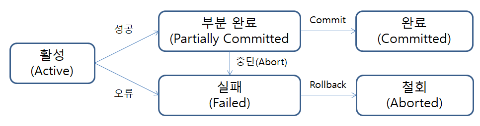
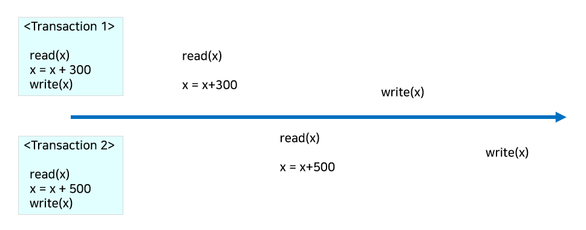
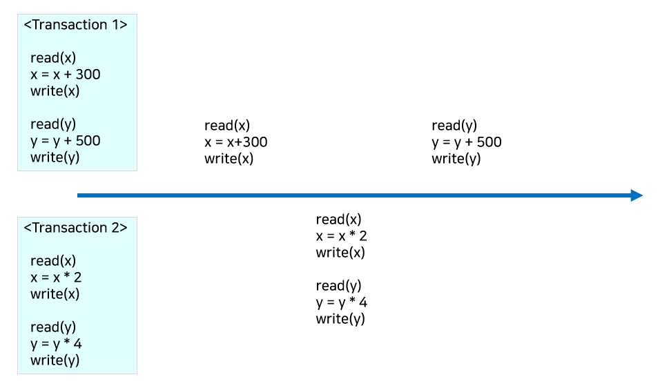

# 트랜잭션 (Transaction)

데이터베이스의 상태를 변환시키는 하나의 논리적 기능을 수행하기 위한 작업의 단위 혹은 일련의 연산

> ex) A가 B에게 2000을 송금
> 이때, 주는 행위와 받는 행위는 별개로 분리될 수 없는 항상 함께 처리됨
> 이철럼 하나의 거래 안에서 함께 처리 되어야 하는 최소 단위를 트랜잭션이라고 함

  

## 트랜잭션을 사용하는 이유는?

트랜잭션은 서버에서 여러 개의 요청을 동시에 처리하는 과정에서 중단될 경우, 데이터가 서로 맞지 않게되는 것을 방지하고자 할 때 사용

> ex) A가 계좌이체를 통해 B의 계좌로 송금
> A의 계좌에서 출금
> B의 계좌로 입금
> 둘 중 하나라도 실패한다면 -> 반영되어서는 안됨

  

## 트랜잭션의 성질(ACID)

- **원자성(Atomicity)**:
  - 트랜잭션의 처리는 모두 반영 or 아예 반영되지 않음
  - 모든 명령은 완벽히 수행되어야 함
  - 하나의 오류라도 발생하면 전부가 취소되어야 함

> 오류 발생의 예) A의 돈이 출금되지 않은 상태로 B에게 입금
> A의 돈이 출금되었지만 B에게 입금이 되지 않음

 

- **일관성(Consistency)**:
  - 트랜잭션을 성공적으로 완료하면, 일관성 있는 데이터베이스 상테로 변환함
  - 시스템의 고정요소는 트랜잭션 수행 전/후의 상태가 같아야 함

> ex) A가 B에게 2000원을 송금
> 변하지 않는 고정 요소 = 이동한 돈의 총액(2000원)

 

- **독립성(Isolation)**:
  - 트랜잭션끼리는 서로 간섭할 수 없음
  - 수행 중인 트랜잭션이 완료될 때까지는 다른 트랜잭션은 해당 트랜잭션을 참조할 수 없음

> ex) A가 B에게 2000원을 송금하는 트랜잭션을 실행 중
> A의 계좌 또는 B의 계좌 데이터를 참조할 수 없음

 

- **지속성(Durability)**:
  -  성공적으로 완료된 트랜잭션의 결과는 시스템 고장과 관게없이 영구적으로 작업의 결과가 저장된다.

  

## 트랜잭션 연산

**커밋(Commit)**:
  - 한개의 트랜잭션에 대한 작업이 성공적으로 끝났음을 확정하는 명령어
  - 커밋 == 하나의 트랜잭션이 종료됨

 

**롤백(Rollback)**:
  - 작업 중 문제가 발생하여 트랜잭션이 수행한 모든 작업을 취소하는 명령어
  - 트랜잭션이 시작되기 이전의 상태로 되돌림

  

## 트랜잭션 병행 제어

> 병행(Concurrency)이란?
> 매우 빠르게 여러 트랜잭션 사이를 이동하면서 조금씩 처리를 수행하는 방식이다.
> 실제로는 한 번에 한 트랜잭션만 수행하지만, 동시에 여러 트랜잭션을 수행하는 것처럼 보이도록 하는 것이다.

**병행 제어**는 트랜잭션이 데이터베이스의 일관성을 파괴하지 않고, 다른 트랜잭션에 영향을 주지 않도록 트랜잭션 간의 상호작용을 제어하는 것이다.

### 병행 제어의 목적

- 데이터베이스의 일관성 유지
- 데이터베이스 공유 최대화
- 시스템 활용도 최대화
- 사용자 응답 시간 최소화
- 단위 시간당 트랜잭션 처리 건수 최대화

### 병행의 문제점
  - **Dirty Write**:
    - 같은 데이터에 대해 동시에 두개 이상의 트랜잭션이 값을 바꾸고자 할 때 발생
  - **Dirty Read**:
    - 아직 커밋되지 않은 트랜잭션의 스기 내용을 읽는 것
    - 비정상적 상태의 데이터를 일게 되는 현상
  - **Non-repeatable Read**:
    - 어떤 트랜잭션에서 동일한 데이터의 값을 읽을 때마다 매번 달라지는 현상
  - **phantoom Read**:
    - 기존 데이터는 동일한데 새로 추가된 값에 의해 데이터 값이 변경되는 현상

### 병행 제어를 하지 않았을 때

트랜잭션들이 동시에 데이터베이스에 접근할 수 있게되며 다음과 같은 문제가 발생

1. 갱신분실(Lost update):  
   같은 데이터에 대해 둘 이상의 트랜잭션이 동시에 갱신할 때, 갱신 결과의 일부가 없어지는 현상

   >
   > 위의 상황에서는 같은 데이터인 x에 대해서 트랜잭션 1이 갱신하기 전에 트랜잭션 2가 x값을 받아와 최종 결과가 x+500이 되는 갱신분실의 모습을 보여준다.

    

2. 모순성(Inconsistency):  
   하나의 트랜잭션이 여러 데이터 갱신 연산을 수행할 때, 일관성 없는 상태의 데이터베이스에서 데이터를 가져옴으로서 데이터의 불일치가 발생

> 
> 트랜잭션 1이 커밋되기 전에 트랜잭션 2가 수행되는 모습으로 트랜잭션 1의 입장에서의 데이터 불일치가 발생한다.
> 트랜잭션 1에서 기대한 결과: y + 500 
> 실제 결과: y * 4 + 500
> 트랜잭션 1에서는 실행 전후의 y의 차이가 500만큼 발생해야 하는데 그보다 더 큰 차이가 발생하며 데이터의 불일치가 발생한다.

 

1. 연쇄 복귀(Cascading Rollback):  
    병행 수행되던 둘 이상의 트랜잭션 중 어느 한 트랜잭션에 오류가 발생하여 Rollback하는 경우 다른 트랜잭션들도 함께 Rollback되는 현상
2. 비완료 의존성(uncommitted dependency):  
    하나의 트랜잭션 수행이 실패한 후 회복하기 전에 다른 트랜잭션이 실패한 갱신 결과를 참조하는 현상

### 병행 제어 기법

1. **로킹** (Locking)
2. **2단계 로킹 규약** (Two-Phase Locking, 2PL)
3. **타임스탬프 순서 기법** (Timestamp Ordering)
4. **낙관적 병행 제어** (Optimistic concurrency control)
5. **다중 버전 병행 제어** (Multi-version Concerrency Control)

---
출처 

[트랜잭션이란 무엇인가?](https://blog.toktokhan.dev/%ED%8A%B8%EB%9E%9C%EC%9E%AD%EC%85%98-%EC%9D%B4%EB%9E%80-%EB%AC%B4%EC%97%87%EC%9D%B8%EA%B0%80-986d40d112ac)

 

[트랜잭션](https://itwiki.kr/w/%ED%8A%B8%EB%9E%9C%EC%9E%AD%EC%85%98)