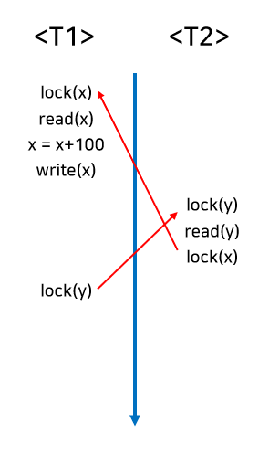
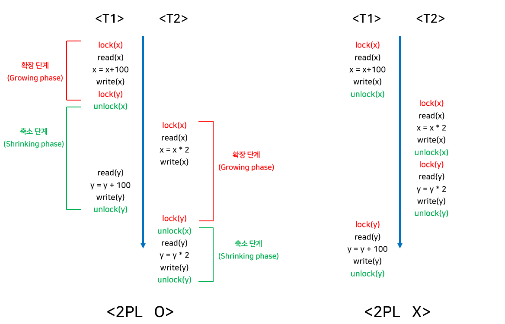

# 트랜잭션 (Transaction)

데이터베이스의 상태를 변환시키는 하나의 논리적 기능을 수행하기 위한 작업의 단위 혹은 일련의 연산

> ex) A가 B에게 2000을 송금
> 이때, 주는 행위와 받는 행위는 별개로 분리될 수 없는 항상 함께 처리됨
> 이철럼 하나의 거래 안에서 함께 처리 되어야 하는 최소 단위를 트랜잭션이라고 함

  

## 트랜잭션을 사용하는 이유는?

트랜잭션은 서버에서 여러 개의 요청을 동시에 처리하는 과정에서 중단될 경우, 데이터가 서로 맞지 않게되는 것을 방지하고자 할 때 사용

> ex) A가 계좌이체를 통해 B의 계좌로 송금
> A의 계좌에서 출금
> B의 계좌로 입금
> 둘 중 하나라도 실패한다면 -> 반영되어서는 안됨

  

## 트랜잭션의 성질(ACID)

- **원자성(Atomicity)**:
  - 트랜잭션의 처리는 모두 반영 or 아예 반영되지 않음
  - 모든 명령은 완벽히 수행되어야 함
  - 하나의 오류라도 발생하면 전부가 취소되어야 함

> 오류 발생의 예) A의 돈이 출금되지 않은 상태로 B에게 입금
> A의 돈이 출금되었지만 B에게 입금이 되지 않음

 

- **일관성(Consistency)**:
  - 트랜잭션을 성공적으로 완료하면, 일관성 있는 데이터베이스 상테로 변환함
  - 시스템의 고정요소는 트랜잭션 수행 전/후의 상태가 같아야 함

> ex) A가 B에게 2000원을 송금
> 변하지 않는 고정 요소 = 이동한 돈의 총액(2000원)

 

- **독립성(Isolation)**:
  - 트랜잭션끼리는 서로 간섭할 수 없음
  - 수행 중인 트랜잭션이 완료될 때까지는 다른 트랜잭션은 해당 트랜잭션을 참조할 수 없음

> ex) A가 B에게 2000원을 송금하는 트랜잭션을 실행 중
> A의 계좌 또는 B의 계좌 데이터를 참조할 수 없음

 

- **지속성(Durability)**:
  -  성공적으로 완료된 트랜잭션의 결과는 시스템 고장과 관게없이 영구적으로 작업의 결과가 저장된다.

  

## 트랜잭션 연산

**커밋(Commit)**:
  - 한개의 트랜잭션에 대한 작업이 성공적으로 끝났음을 확정하는 명령어
  - 커밋 == 하나의 트랜잭션이 종료됨

 

**롤백(Rollback)**:
  - 작업 중 문제가 발생하여 트랜잭션이 수행한 모든 작업을 취소하는 명령어
  - 트랜잭션이 시작되기 이전의 상태로 되돌림

  

## 트랜잭션 병행 제어

> 병행(Concurrency)이란?
> 매우 빠르게 여러 트랜잭션 사이를 이동하면서 조금씩 처리를 수행하는 방식이다.
> 실제로는 한 번에 한 트랜잭션만 수행하지만, 동시에 여러 트랜잭션을 수행하는 것처럼 보이도록 하는 것이다.

**병행 제어**는 트랜잭션이 데이터베이스의 일관성을 파괴하지 않고, 다른 트랜잭션에 영향을 주지 않도록 트랜잭션 간의 상호작용을 제어하는 것이다.

### 병행 제어의 목적

- 데이터베이스의 일관성 유지
- 데이터베이스 공유 최대화
- 시스템 활용도 최대화
- 사용자 응답 시간 최소화
- 단위 시간당 트랜잭션 처리 건수 최대화

### 병행의 문제점
  - **Dirty Write**:
    - 같은 데이터에 대해 동시에 두개 이상의 트랜잭션이 값을 바꾸고자 할 때 발생
  - **Dirty Read**:
    - 아직 커밋되지 않은 트랜잭션의 스기 내용을 읽는 것
    - 비정상적 상태의 데이터를 일게 되는 현상
  - **Non-repeatable Read**:
    - 어떤 트랜잭션에서 동일한 데이터의 값을 읽을 때마다 매번 달라지는 현상
  - **phantoom Read**:
    - 기존 데이터는 동일한데 새로 추가된 값에 의해 데이터 값이 변경되는 현상

### 병행 제어를 하지 않았을 때

트랜잭션들이 동시에 데이터베이스에 접근할 수 있게되며 다음과 같은 문제가 발생

1. 갱신분실(Lost update):  
   같은 데이터에 대해 둘 이상의 트랜잭션이 동시에 갱신할 때, 갱신 결과의 일부가 없어지는 현상

   >
   > 위의 상황에서는 같은 데이터인 x에 대해서 트랜잭션 1이 갱신하기 전에 트랜잭션 2가 x값을 받아와 최종 결과가 x+500이 되는 갱신분실의 모습을 보여준다.

    

2. 모순성(Inconsistency):  
   하나의 트랜잭션이 여러 데이터 갱신 연산을 수행할 때, 일관성 없는 상태의 데이터베이스에서 데이터를 가져옴으로서 데이터의 불일치가 발생

> 
> 트랜잭션 1이 커밋되기 전에 트랜잭션 2가 수행되는 모습으로 트랜잭션 1의 입장에서의 데이터 불일치가 발생한다.
> 트랜잭션 1에서 기대한 결과: y + 500 
> 실제 결과: y * 4 + 500
> 트랜잭션 1에서는 실행 전후의 y의 차이가 500만큼 발생해야 하는데 그보다 더 큰 차이가 발생하며 데이터의 불일치가 발생한다.

 

1. 연쇄 복귀(Cascading Rollback):  
    병행 수행되던 둘 이상의 트랜잭션 중 어느 한 트랜잭션에 오류가 발생하여 Rollback하는 경우 다른 트랜잭션들도 함께 Rollback되는 현상
2. 비완료 의존성(uncommitted dependency):  
    하나의 트랜잭션 수행이 실패한 후 회복하기 전에 다른 트랜잭션이 실패한 갱신 결과를 참조하는 현상

### 병행 제어 기법

1. **로킹** (Locking)
   : 트랜잭션이 접근하려는 데이터를 다른 트랜잭션이 접근하지 못하도록 잠그는 병행 제어 기법  

   이를 통해 상호 배제 기능을 제공하며, 잠금을 설정한 트랜잭션이 해제할 때까지 데이터를 독점적으로 사용할 수 있다. 
   
   **로킹 단위**: 한 번에 로킹할 수 있는 데이터의 크기
   ex. 필드, 레코드. 테이블, 파일, 데이터베이스 
   
   로킹 단위가 크다면 -> 단순하고 관리가 편함 but 병행성 수준이 낮아진다.
   로킹 단위가 작다면 -> 병행 제어가 복잡해지고 오버헤드가 증가 but 병행성 수준이 높아지고 데이터 베이스 공유도가 높아진다. 
   
   로킹 규약 
      1. 트랜잭션 T가 공유 데이터 x를 접근하려면 먼저 lock(x)을 해야 한다. 
      2. 공유 데이터를 사용한 T는 반드시 unlock(x)을 해야 한다. 
      3. 다른 트랜잭션에 의해 lock(x)가 실행되었다면, 트랜잭션 T는 lcok(x)을 실행하지 못한다. 
      4. 트랜잭션 T가 lock(x) 한 것을 다른 트랜잭션이 unlock(x)할 수 없다. 

    위와 같은 로킹 규약에는 제약이 있는데,
    하나의 트랜잭션만이 공유 데이터를 사용할 수 있는데, 오직 읽기만 하는 경우에는 동시에 접근해도 문제가 없기 때문에 효율적이지 못하다. 
    이를 해결하기 위해 사용되는 것이 2단계 로킹 규약이다. 

    또한 교착 상태가 발생할 수 있는 한계가 있는데,
    
    위처럼 T1에서 x를 lock하고 T2애서 y를 lock한 경우에, T1도 y에 접근할 수 없고 T2도 x에 접근 할 수 없어 무한정 기다리게 되는 상황을 교착 상태라고 한다.

   

2. **2단계 로킹 규약** (Two-Phase Locking, 2PL)
    : 각 트랜잭션의 lock과  unlock 요청을 2단계로 실시하는 방식

     

    확장 단계와 축소 단계로 나뉘며, 이를 통해 직렬성을 보장하는 대표적인 로킹 규약이지만 여전히 교착 상태를 예방할 수 없다는 단점이 있다. 

    - 확장 단계: 새로운 lock 연산만을 수행할 수 잇고, unlock 연산은 수행할 수 없는 단계
    - 축소 단계: unlock 연산을 수행할 수 있고, lock 연산은 수핼할 수 없는 단계

    트랜잭션 내에 모든 lock 연산이 첫 번째 unlock 연산 이전에위치해야 한다.
    
   
3. **타임스탬프 순서 기법** (Timestamp Ordering)
    : 비직렬 트랜잭션을 타임스탬프 순서에 따라 직렬화 시키는 방법 

    데이터에 접근하는 시간을 미리 정해주고, 부여된 시간 순서대로 데이터에 접근하며, lock을 사용하지 않고 시간을 나눠 사용한다. 
    그로인해 교착 상태가 발생하지 않지만, Rollback 발생률이 높고 연쇄 복귀를 초래할 수 있다는 단점이 생겼다. 

    타임스탬프는 유일하게 트랜잭션을 식별할 수 있는 식별자 역할을 할 수 있으며, 트랜잭션의 시작 시간으로 간주할 수 있다. 
    생성 방법은 논리적 계수기 또는 시스템 클럭을 이용한다.

     - 논리적 계수기: 계수기를 사용하여 트랜잭션이 들어올 때마다 카운터를 하나씩 증가
     - 시스템 클럭: 시스템의 고유 시계 사용

    운영 방식: 
    read_TS(x): read(x) 연산을 성공적으로 수행한 트랜잭션들의 타임스탬프 중 가장 큰 것 
    write_Ts(x): write(x) 연산을 성공적으로 수행한 트랜잭션들의 타임스탬프 중 가장 큰 것 

    2. 트랜잭션 T가 read(x)를 수행하려 할 때 
    TS(T) < write_TS(x)이면, read(x)를 거부, T 취소 & 복귀 
    TS(T) < write_TS(x)이면, read(x)를 허용, read_TS(x) = TS(T)로 갱신

    1. 트랜잭션 T가 write(x)를 수행하려 할 때 
    TS(T) < read_TS(x)이면, write(x)를 거부, T 취소 & 복귀 
    TS(T) < write_TS(x)이면, write(x)를 수행한 것으로 간주하고 무시, 이외의 경우 write(x)를 허용, write_TS(x) = TS(T)로 갱신 

1. **낙관적 병행 제어** (Optimistic concurrency control)
    : 트랜잭션 수행 동안은 어떤 검사를 하지 않고, 트랜잭션이 종료된 이후에 일괄적으로 검사하는 방식 

    수행 도중에는 트랜잭션을 위해 유지되는 데이터 항목들의 지역 사본에 대해서만 갱신, 트랜잭션이 종료되고 난 후, 직렬화를 검증하여 검증되면 데이터베이스에 한 번에 반영하는 방식이다. 

    병행 수행하고자 하는 대부분의 트랜잭션이 Read-only인 경우, 트랜잭션 간 충동률이 매우 낮기 때문에 병행 제어 기법을 사용하지 않고도 대부분 일관성을 유지한다는 점을 이용하는 방식이다. 

2. **다중 버전 병행 제어** (Multi-version Concerrency Control)
    : 한 데이터에 대해 여러 버전의 값을 유지하며 관리하는 방식 

    타임스탬프의 개념을 이용하며, 다중 버전 타임 스탬프 기법이라고 한다. 

    여러 버전의 타임스탬프를 비교하여 스케줄상 직렬 가능성이 보장되는 타임스탬프를 선택한다.
    충도이 발생할 경우 연쇄 복귀가 발생할 수 있는 단점이 있다. 

---
출처 

[트랜잭션이란 무엇인가?](https://blog.toktokhan.dev/%ED%8A%B8%EB%9E%9C%EC%9E%AD%EC%85%98-%EC%9D%B4%EB%9E%80-%EB%AC%B4%EC%97%87%EC%9D%B8%EA%B0%80-986d40d112ac)

 

[트랜잭션](https://itwiki.kr/w/%ED%8A%B8%EB%9E%9C%EC%9E%AD%EC%85%98)