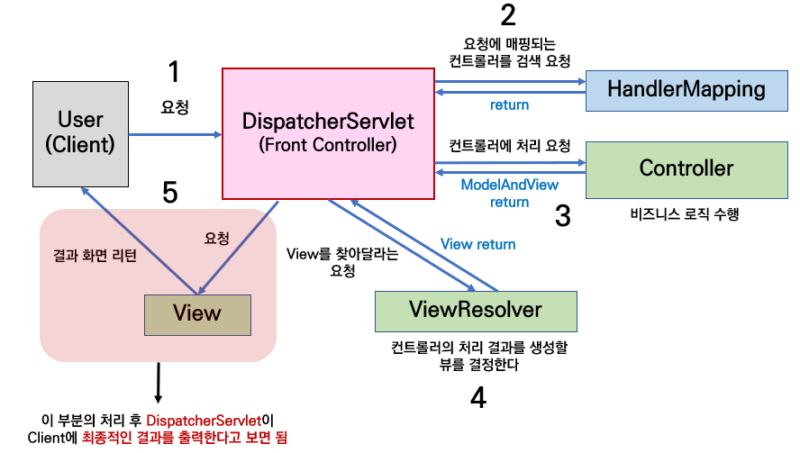

  # Spring MVC pattern
  ----
  - 웹 계층에 **서블릿(Servlet)** API를 기반으로 클라이언트의 요청을 처리하는 모듈을 스프링 웹 MVC(spring-web-mvc) 또는 스프링 MVC라고 함 

  ### Servlet 
    - 클라이언트의 요청을 처리하고, 그 결과를 반환하는 자바 웹 프로그래밍 기술
    - Spring MVC 내부에서는 서블릿 기반으로 웹 애플리케이션이 동작, 스프링부트는 아파치 톰캣을 내장하고 있음
    - 아파치 톰캣 : 서블릿들이 웹 애플리케이션으로 실행할 수 있도록 해주는 서블릿 컨테이너 중 하나

    
  ## MVC Pattern
  ---
  - 애플리케이션을 개발할 때 사용하는 디자인 패턴
  - 애플리케이션의 개발 영역을 Model, View, Controller(MVC)으로 구분하여 각 역할에 맞게 코드를 작성하는 개발 방식
  - MVC 패턴을 도입하면서 UI 영역과 도메인(비즈니스 로직) 영역으로 구분되어 서로에게 영향을 주지 않으면서 개발과 유지보수 가능

 

- **Model**
  - 클라이언트에게 돌려주는 처리 결과 데이터
 

- **View**
  - Modle을 이용하여 애플리케이션의 화면에 보이는 리소스를 제공하는 역할
  - View 기술
    - HTML 페이지 출력
    - PDF, Excel 등 문서 형태 출력
    - XML, JSON 등 특정 형식의 포맷 변환

 

- **Controller**
  - 클라이언트 측의 요청을 직접적으로 전달받는 엔드포인트
  - Model과 View의 중간에서 상호작용을 해주는 역할
  - 클라이언트 측의 요청을 전달받아 비즈니스 로직을 거친 후, Model 데이터가 만들어지면, Model 데이터를 View로 전달하는 역할
  

## Spring MVC의 구조
---

---

- **DispatcherServlet**
    - 클라이언트의 요청을 전달받음, Controller에게 클라이언트의 요청을 전달, 컨트롤러가 리턴한 결과 값을 View에 전달하여 알맞은 응답 생성
    - DispatcherServlet를 Front Controller라고 부르기도 함
    - HTTPServlet을 상속받아 사용, 서블릿으로 동작
 

- **HanderMapping**
    - 클라이언트의 요청 URL을 어떤 컨트롤러가 처리할지 결정하는 기능
 

- **Controller**
    - 클라이언트의 요청을 처리한 뒤, 결과를 리턴함
    - 응답 결과에서 보여줄 데이터를 Model에 담아 전달
    - 이후 Model은 handlerAdpater에 의해 ModelAndView로 변환
 

- **ModelAndView**
    - Contoroller에서 처리한 결과 정보 및 View 선택에 필요한 정보를 담음
 

- **ViewResolver**
    - ModelAndView를 전달받은 DispatcherServlet이 실제 클라이언트에게 보여질 view를 렌더링하기 위해, 어떤 view 객체를 사용할지 결정하기 위하여 ViewResolver를 호출
 

- **View**
    - ViewResolver에 의하여 View 객체가 결정되고 해당 객체를 통해 View를 렌더링 함
  

## Spring MVC 패턴의 장단점
---
#### 장점
1. Model, View, Controller로 나누어 개발할 수 있어, 여러 개발자가 역할을 분담하여 개발하는 것이 가능
2. 중복된 코드를 줄일 수 있고, 확장성이 있으며 유연한 코딩이 가능
3. 컨포넌트 별로 나누어져 있기 때문에 디버깅과 테스팅이 용이함
 

#### 단점
1. 프로젝트의 규모가 커지면 복잡해질 수 있음
2. 하나의 파일에서 모든 로직을 처리하는 대신, 여러 파일로 나누어 개발하기 때문에 유지보수하는데 드는 시간이 길어질 수 있음
  

## 인터페이스
---

스프링 MVC의 큰 장점은 DispatcherServlet 코드의 변경 없이 원하는 기능을 변경하거나 확장할 수 있는것인데, 동작에 필요한 대부분의 기능을 확장할 수 있도록 인터페이스로 제공함
 

**- 주요 인터페이스**
   - **핸들러 매핑** : org.springframework.web.servlet.HandlerMapping
  - **핸들러 어댑터**: org.springframework.web.servlet.HandlerAdapter
  - **뷰 리졸버**: org.springframework.web.servlet.ViewResolver
  - **뷰** : org.springframework.web.servlet.View

   

# REST API Pattern
---
## REST?
Representational State Reansfer의 약자
자원을 이름으로 구분하여 해당 자원의 상태를 주고받는 모든 것

- HTTP URI를 통해 자원을 명시, HTTP Method(POST, GET, PUT, DELETE, PATCH 등)를 통해 해당 자원(URI)에 대해 **CRUD Operation**을 적용하는 것을 의미

> #### CRUD Operation
> CRUD는 대부분의 컴퓨터 소프트웨어가 가지는 기본적인 데이터 처리 기능인 Create, Read, Update, Delete를 묶어서 일컫는 말로, REST에서 CRUD Operation 동작 예시는 다음과 같습니다.
>
> > Create : 데이터 생성(POST)
> > Read : 데이터 조회(GET)
> > Update : 데이터 수정(PUT, PATCH)
> > Delete : 데이터 삭제(DELETE)

  

## REST 구성 요소
---
**1. 자원(Resource)** : HTTP URI
   - 모든 자원에 고유한 ID가 존재, 이 자원은 Server에 존재
   - 자원을 구별하는 ID는 ‘/groups/:group_id’와 같은 HTTP URI Client는 URI를 이용해서 자원을 지정하고 해당 자원의 상태(정보)에 대한 조작을 Server에 요청
 

**2. 자원에 대한 행위(Verb)** : HTTP Method
- HTTP 프로토콜의 Method를 사용
- HTTP 프로토콜은 GET, POST, PUT, DELETE와 같은 메서드를 제공
 

**3. 자원에 대한 행위의 내용(Representation)** : HTTP Message Pay Load
- Client가 자원의 상태에 대한 조작을 요청
- Server는 적절한 응답을 보냄
- REST에서 하나의 자원은 **JSON**, **XML**, TEXT, RSS 등 여러 형태의 응답을 받을 수 있음
 
 

## REST의 특징
---
   **1. Server-Clinent(서버-클라이언트 구조)**
    - REST 서버는 API 제공, 클라이언트는 사용자 인증이나 컨텍스트 등을 직접 관리하는 구조로 각각의 역할이 확실히 구분 됨
    - 클라이언트와 서버에서 개발해야 할 내용이 명확해지고 서로간 의존성이 줄어들게 됨
 

   **2. Stateless(무상태)**
    - REST는 무상태성 성격을 갖고 있음(상태정보를 따로 저장하고 관리하지 X)
    - API 서버는 들어오는 요청만을 단순히 처리하면 됨
    - 서비스의 자유도가 높아짐, 서버에 불필요한 정보를 관리하지 않아 구현이 단순해짐

 

   **3. Cacheable(캐시 처리 가능)**
    - REST의 가장 큰 특징 중 하나인 HTTP 기존 웹 표준을 그대로 사용한다는 점 덕분에, 웹에서 사용하는 기존 인프라를 그대로 활용이 가능함
    - HTTP가 가진 캐싱 기능이 적용 가능함(Last-Modified 태그 or E-Tag 이용)

 

   **4. Layered System(계층화)**
    - REST 서버는 다중 계층으로 구성될 수 있으며 보안, 로드 밸런싱, 암호화 계층을 추가해 구조상의 유연성을 둘 수 있음
    - PROXY, 게이트웨이 같은 네트워크 기반의 중간매체를 사용할 수 있게 합니다.
 

   **5. Uniform Interface(인터페이스 일관성)**
    - URI로 지정한 리소스에 대한 조작을 통일되고 한정적인 인터페이스로 수행하는 아키텍처 스타일을 말 함
 

  **6. Self-descriptiveness(자체 표현 구조)**
    - REST의 또 다른 특징 중 하나는 REST API 메세지만 보고도 이를 쉽게 이해 할 수 있는 자체 표현 구조로 되어있다는 것

 
 

## REST의 장단점
---
#### 장점
- HTTP 프로토콜의 인프라를 그대로 사용, REST API 사용을 위한 별도의 인프라를 구출할 필요 없음
- HTTP 프로토콜의 표준을 최대한 활용, 여러 추가적인 장점을 함께 가져갈 수 있게 함
- HTTP 표준 프로토콜에 따르는 모든 플랫폼에서 사용이 가능함
- Hypermedia API 메시지가 의도하는 바를 명확히 나타내므로 의도하는 바를 쉽게 파악 가능
- 여러 가지 서비스 디자인에서 생길 수 있는 문제 최소화
- 서버와 클라이언트의 역할 명확하게 분리
 

#### 단점
- 표준이 존재하지 않아 정의가 필요함
- HTTP Method 형태가 제한적
- 브라우저를 통해 테스트할 일이 많은 서비스라면 쉽게 고칠 수 있는 URL보다 Header 정보의 값을 처리해야 함
- 구형 브라우저에 호환되지 않아 지원해주지 못하는 동작이 많음

 
 

## REST API
---
REST의 원리를 따르는 API
 

### REST API 설계 예시
---
   1. URI는 동사보다 명사를, 대문자보다는 소문자를 사용
  >Bad Example http://khj93.com/Running/
  Good Example  http://khj93.com/run/

 

  2. 마지막에 슬래시가 없음
  
  >Bad Example http://khj93.com/test/  
  > Good Example  http://khj93.com/test
  >> 슬래시 구분자는 계층 관계를 나타내는데 사용됨 

 

  3. 언더바 대신 하이픈 사용
  >Bad Example http://khj93.com/test_blog
  >Good Example  http://khj93.com/test-blog  
  >> 하이픈은 가독성을 높이는데 사용됨

 

  4. 파일확장자는 URI에 미포함
  >Bad Example http://khj93.com/photo.jpg  
  >Good Example  http://khj93.com/photo  

 

  5. 행위를 포함하지 않음
  >Bad Example http://khj93.com/delete-post/1  
  > Good Example  http://khj93.com/post/1  

 

  6. 리소스 간에는 연관 관계가 있는 경우
  => /리소스명/리소스 ID/관계가 있는 다른 리소스명
  > GET : /users/{userid}/devices (일반적으로 소유 ‘has’의 관계를 표현할 때)

 
 

## RESTful?
---
REST의 원리를 따르는 시스템
- **REST API 설계 규칙을 올바르게 지킨 시스템을 RESTful하다고 할 수 있음**
- **이해하기 쉽고 사용하기 쉬운 REST API**를 만드는 것이 **목적**
- URI 규칙을 올바르게 지키지 않은 API, REST API의 설계 규칙을 올바르게 지키지 못한 시스템은 REST API를 사용하였어도 RESTful하지 못한 시스템이라고 할 수 있다.

 
 

## Path Variabel vs Query Parameter
---
**Path Variablre**
> GET /users/10

전체 데이터 또는 특정 하나의 데이터를 다룰 떄 처럼, 리소스를 식별하기 위해 사용

 

**Query Parameter**
>GET /users?user_id=10

데이터의 좀 더 깊은 속성 값을 조정하거나, 세밀하게 데이터를 정렬하거나 필터링 하고 싶을 경우 더 적합함

 
 

API를 개발할 때에는 PATH 방법과 Query 방법을 필요에 따라 적절하게 사용하고, 데이터 요청 시 API 명세에 따르도록 해야 함
API 명세는 협업 시, 프론트와 백엔드가 잘 협업하여 설계하도록 함
  

---
#### 자료 출처
[[Spring] 스프링 MVC 패턴에 대해 알아봅시다.
](https://velog.io/@choidongkuen/Spring-MVC-%ED%8C%A8%ED%84%B4%EC%97%90-%EB%8C%80%ED%95%B4-%EC%95%8C%EC%95%84%EB%B4%85%EC%8B%9C%EB%8B%A4) - velog

[[Spring MVC] 스프링 MVC란 무엇인가? - 스프링 MVC 구조 이해](https://ittrue.tistory.com/234
) - tistory

[REST API 제대로 알고 사용하기
](https://meetup.nhncloud.com/posts/92) - NHN Cloud Meetup

[[네트워크]REST API란? REST, RESTful이란?](https://khj93.tistory.com/entry/%EB%84%A4%ED%8A%B8%EC%9B%8C%ED%81%AC-REST-API%EB%9E%80-REST-RESTful%EC%9D%B4%EB%9E%80#google_vignette) - tistory